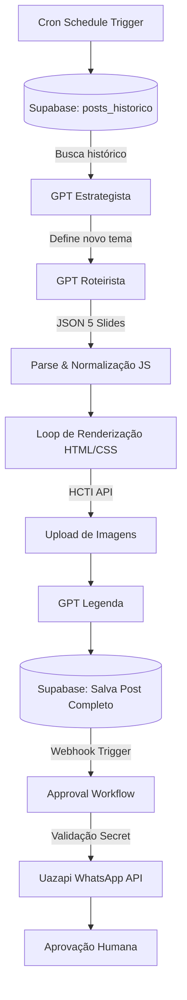

  

<h1 align="center">AgilDev — AI Content Automation Pipeline</h1>

  <b>Strategy</b> &nbsp;•&nbsp; 
  <b>Generation</b> &nbsp;•&nbsp; 
  <b>Rendering</b> &nbsp;•&nbsp; 
  <b>Approval</b>

  Pipeline de automação de conteúdo baseado em IA, responsável por transformar uma pauta em um carrossel estruturado, renderizado e preparado para aprovação.

   &nbsp;&nbsp;
   &nbsp;&nbsp;
   &nbsp;&nbsp;
  

---

## 📌 Visão Geral

Este projeto automatiza parte do processo de produção de conteúdo da **AgilDev - Automações & I.A**.

A partir de um fluxo agendado, o sistema consulta temas utilizados anteriormente, define um novo tema, gera o roteiro do carrossel com IA, estrutura os slides, processa a renderização dos criativos e salva o conteúdo gerado para as próximas etapas do processo.

O projeto também possui um fluxo separado de aprovação, responsável por receber o novo conteúdo, validar sua origem e encaminhar os materiais para aprovação antes da distribuição.

## 🎯 O Problema

A produção recorrente de conteúdo envolve diversas etapas manuais: definição de pautas, criação de roteiros, organização dos slides, renderização dos criativos, armazenamento e envio para aprovação.

O objetivo deste projeto foi transformar esse processo em um pipeline reproduzível, mantendo regras de negócio e pontos de validação ao longo da execução.

## ⚙️ A Solução

O processo foi dividido em etapas independentes:

1. Consulta do histórico de conteúdos já utilizados no banco relacional.
2. Seleção de um novo tema inédito com apoio de IA (GPT Estrategista).
3. Geração estruturada do roteiro completo do carrossel.
4. Validação e normalização da resposta da IA via código.
5. Processamento individual dos slides via looping.
6. Montagem dos criativos utilizando HTML e CSS dinâmicos.
7. Renderização automatizada dos slides em imagens.
8. Geração da legenda otimizada para engajamento.
9. Persistência dos dados e mídias geradas no histórico.
10. Encaminhamento do conteúdo via Webhook para a camada de aprovação.

---

## 🏗️ Arquitetura do Sistema

---

## 🖼️ Visualização dos Criativos Gerados

O pipeline gera automaticamente carrosséis de 5 slides padronizados via código HTML/CSS e os renderiza em imagens de alta definição:

| Slide 1 (Hook) | Slide 2 (Problema) | Slide 3 (Impacto) | Slide 4 (Solução) | Slide 5 (CTA) |
| :---: | :---: | :---: | :---: | :---: |
|  |  |  |  |  |

---

## 🗺️ Mapeamento dos Workflows (n8n)

### 1. Fluxo Principal de Geração (`instagram_AgilDev`)

### 2. Fluxo de Aprovação via WhatsApp (`AgilDev - Approval Workflow`)

---

## 🛠️ Tecnologias Utilizadas

| Componente | Tecnologia | Função no Pipeline |
| :--- | :--- | :--- |
| **Orquestrador** | n8n | Automação de fluxos, condicionais e integrações HTTP |
| **Inteligência Artificial** | OpenAI (`gpt-4o-mini`) | Estratégia de pauta, criação do roteiro JSON e legenda |
| **Banco de Dados** | Supabase (PostgreSQL) | Consulta de histórico anti-duplicação e armazenamento |
| **Renderizador** | HTML/CSS + HCTI API | Conversão de layouts de código em imagens finalizadas |
| **Mensageria** | Uazapi (WhatsApp API) | Disparo das mídias e botões de validação para aprovação humana |

---

## 🛡️ Destaques de Engenharia e Boas Práticas

- **Tratamento de Dados de IA:** Implementação de tratamento e validação de JSON via JavaScript customizado para prevenir quebra de layout na renderização do HTML.
- **Arquitetura Desacoplada:** Separação limpa entre o fluxo de geração de conteúdo e o fluxo de mensageria/aprovação via Webhooks.
- **Camada de Segurança:** Uso de chaves de API restritas via variáveis de ambiente e validação de requisições do webhook por meio de cabeçalhos customizados (`x-webhook-secret`).
- **Idempotência:** A consulta prévia de pautas no Supabase previne a geração contínua de conteúdos repetidos sobre o mesmo assunto.
