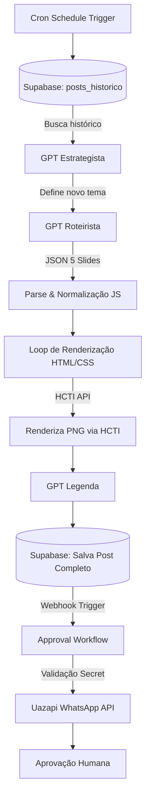
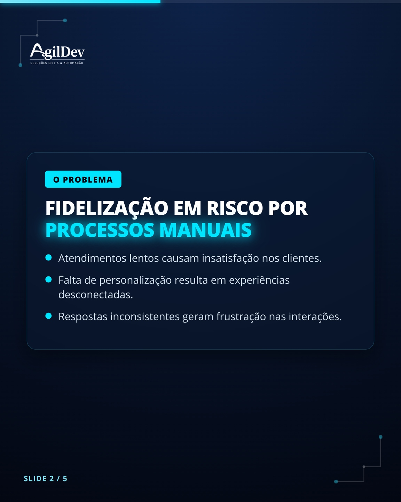
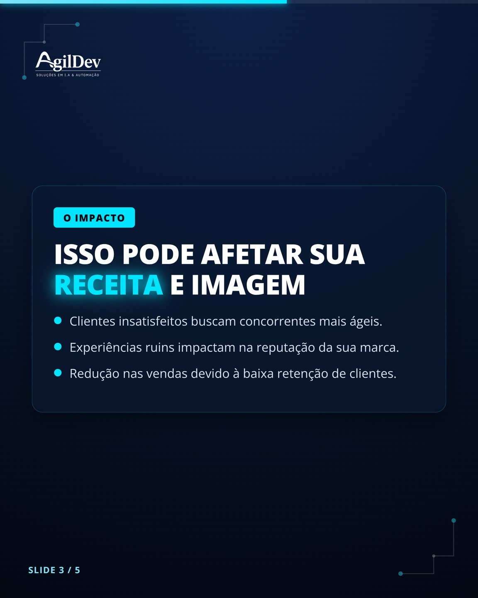
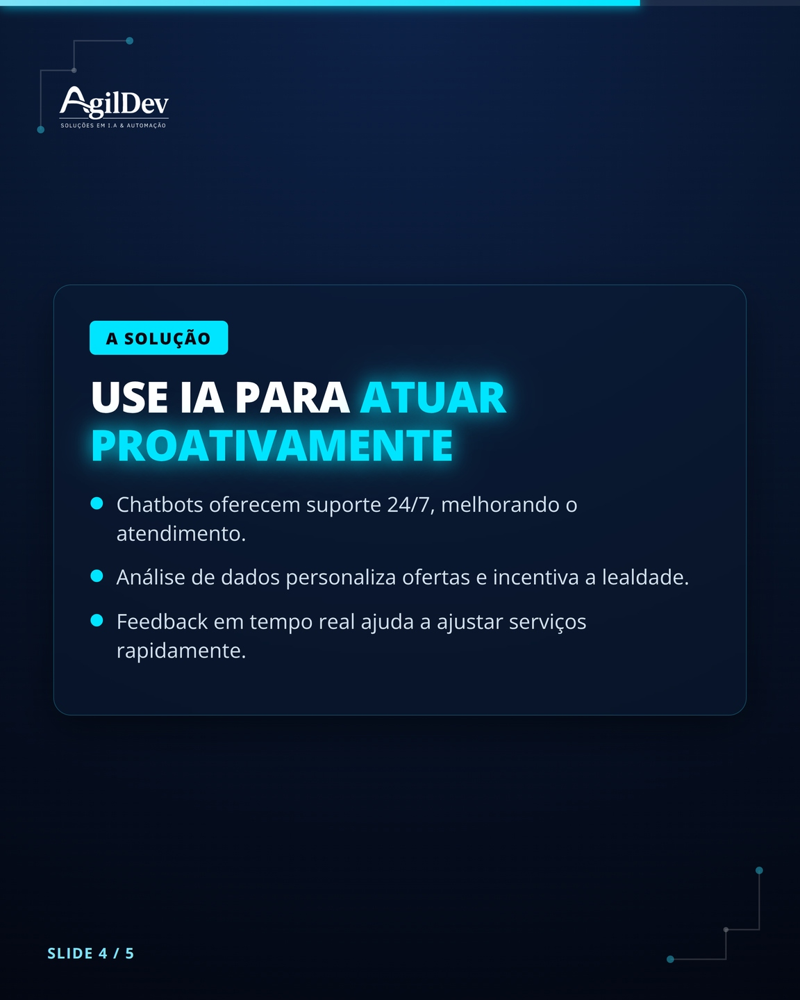
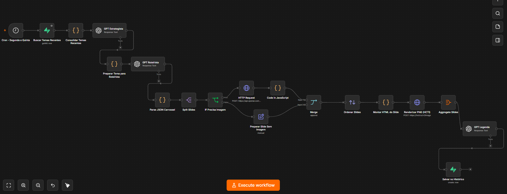
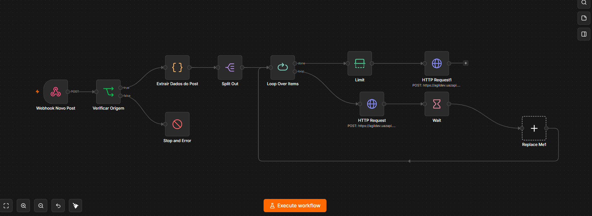

<h1 align="center">AI Content Pipeline — Estudo de Caso em Automação com IA</h1>

  <b>Strategy</b> &nbsp;•&nbsp; 
  <b>Generation</b> &nbsp;•&nbsp; 
  <b>Rendering</b> &nbsp;•&nbsp; 
  <b>Approval</b>

  Estudo de caso técnico de um pipeline de automação de conteúdo baseado em IA, construído com n8n, aplicado a um fluxo real de produção de carrosséis para redes sociais.

   &nbsp;&nbsp;
   &nbsp;&nbsp;
   &nbsp;&nbsp;
  

  <a href="#-visão-geral">Visão Geral</a> •
  <a href="#-o-problema">O Problema</a> •
  <a href="#️-a-solução">A Solução</a> •
  <a href="#️-arquitetura-do-sistema">Arquitetura</a> •
  <a href="#-estratégia-de-prompt-engineering">Prompt Engineering</a> •
  <a href="#-desafios-técnicos">Desafios</a> •
  <a href="#-próximos-passos">Roadmap</a>

---

## 📌 Visão Geral

Este repositório documenta um pipeline de automação de conteúdo baseado em IA que desenvolvi para estudar, na prática, como estruturar um fluxo de produção real usando orquestração de automação, LLMs e engenharia de prompt.

A partir de um fluxo agendado, o sistema consulta temas utilizados anteriormente, define um novo tema, gera o roteiro do carrossel com IA, estrutura os slides, processa a renderização dos criativos e salva o conteúdo gerado para as próximas etapas do processo.

O projeto também possui um fluxo separado de aprovação, responsável por receber o novo conteúdo, validar sua origem e encaminhar os materiais para aprovação humana antes da distribuição.

> Este repositório documenta a arquitetura e as decisões técnicas de um pipeline aplicado a um cenário real de produção de conteúdo, como estudo de engenharia de automação com IA — parte da minha evolução técnica na área.

## 🎯 O Problema

A produção recorrente de conteúdo envolve diversas etapas manuais: definição de pautas, criação de roteiros, organização dos slides, renderização dos criativos, armazenamento e envio para aprovação.

O objetivo deste estudo foi transformar esse processo em um pipeline reproduzível, mantendo regras de negócio e pontos de validação humana ao longo da execução.

## ⚙️ A Solução

O processo foi dividido em etapas independentes:

1. Consulta do histórico de conteúdos já utilizados no banco relacional.
2. Seleção de um novo tema inédito com apoio de IA (GPT Estrategista).
3. Geração estruturada do roteiro completo do carrossel.
4. Validação e normalização da resposta da IA via código.
5. Processamento individual dos slides via looping.
6. Montagem dos criativos utilizando HTML e CSS dinâmicos.
7. Renderização automatizada dos slides em imagens.
8. Geração da legenda otimizada para engajamento.
9. Persistência dos dados e mídias geradas no histórico.
10. Encaminhamento do conteúdo via Webhook para a camada de aprovação.

---

## 🏗️ Arquitetura do Sistema

---

## 🖼️ Visualização dos Criativos Gerados

O pipeline gera automaticamente carrosséis de 5 slides padronizados via código HTML/CSS e os renderiza em imagens de alta definição:

| Slide 1 (Hook) | Slide 2 (Problema) | Slide 3 (Impacto) | Slide 4 (Solução) | Slide 5 (CTA) |
| :---: | :---: | :---: | :---: | :---: |
|  |  |  |  |  |

---

## 🗺️ Mapeamento dos Workflows (n8n)

### 1. Fluxo Principal de Geração (`instagram_AgilDev`)

### 2. Fluxo de Aprovação via WhatsApp (`AgilDev - Approval Workflow`)

---

## 🛠️ Tecnologias Utilizadas

| Componente | Tecnologia | Função no Pipeline |
| :--- | :--- | :--- |
| **Orquestrador** | n8n | Automação de fluxos, condicionais e integrações HTTP |
| **Inteligência Artificial** | OpenAI (`gpt-4o-mini`) | Estratégia de pauta, criação do roteiro JSON e legenda |
| **Banco de Dados** | Supabase (PostgreSQL) | Consulta de histórico anti-duplicação e armazenamento |
| **Renderizador** | HTML/CSS + HCTI API | Conversão de layouts de código em imagens finalizadas |
| **Mensageria** | Uazapi (WhatsApp API) | Disparo das mídias e botões de validação para aprovação humana |

---

## 🛡️ Destaques de Engenharia e Boas Práticas

- **Tratamento de Dados de IA:** implementação de tratamento e validação de JSON via JavaScript customizado para prevenir quebra de layout na renderização do HTML.
- **Arquitetura Desacoplada:** separação limpa entre o fluxo de geração de conteúdo e o fluxo de mensageria/aprovação via Webhooks.
- **Camada de Segurança:** uso de chaves de API restritas via variáveis de ambiente e validação de requisições do webhook por meio de cabeçalhos customizados (`x-webhook-secret`).
- **Idempotência:** a consulta prévia de pautas no Supabase previne a geração contínua de conteúdos repetidos sobre o mesmo assunto.

---

## 🧠 Estratégia de Prompt Engineering

O maior desafio do projeto não foi a integração das APIs, mas garantir que a IA produzisse conteúdo consistente, sem repetição e dentro de um contrato de dados rígido.

- **Saída estruturada forçada:** o GPT Roteirista responde exclusivamente em JSON (`response_format: json_object`), eliminando parsing frágil de texto livre.
- **Anti-duplicação semântica:** o GPT Estrategista recebe os últimos 15 temas publicados e é instruído a rejeitar não só repetições exatas, mas variações semânticas do mesmo ângulo.
- **Guardrails de conteúdo:** regras explícitas contra estatísticas inventadas, clichês de copywriting genérico e promessas absolutas — o prompt trata a marca como uma fonte confiável, não como gerador de hype.
- **Camada de validação em código:** um node em JavaScript normaliza a resposta da IA antes de seguir no pipeline, garantindo que campos como `bullets` nunca quebrem a renderização por ausência ou tipo incorreto.

---

## 🔧 Desafios Técnicos

- **Perda intermitente de slides na renderização:** identificado um bug onde um dos 5 slides desaparecia no meio do fluxo de loop + geração de imagem; em investigação/correção no node de agregação.
- **Custo de geração de imagem via IA:** a geração via `gpt-image-2` foi desativada em produção para controle de custo, substituída por renderização HTML/CSS via HCTI — decisão consciente de trade-off custo x qualidade visual.

---

## 🔮 Próximos Passos

- [ ] Reativar geração de imagens com IA como opção configurável por slide
- [ ] Workflow de tratamento da resposta SIM/NAO da aprovação via WhatsApp
- [ ] Métricas de engajamento por tema para retroalimentar o GPT Estrategista

---

## 👨‍💻 Autor

**Felipe Dourado** — AI Solutions Engineer & Tech Lead na AgilDev

 
 

